```{r setup, include=FALSE}
knitr::opts_chunk$set(
  echo = TRUE,
  warning = FALSE,
  message = FALSE
)

library(dplyr)
library(readr)
library(ggplot2)
library(knitr)
```
# Introduction

Divorce patterns provide an important window into demographic and social change. Regional variation in divorce behavior reflects differences in population structure, marital composition, and socio-economic dynamics. Understanding these patterns helps explain how demographic change unfolds across regions.

Switzerland offers a useful setting for this analysis because detailed canton-level administrative statistics are publicly available. By combining divorce records with demographic population data, we can examine how population size and marital structure relate to observed divorce counts.

The objectives of this project are to:

- describe divorce trends across cantons and over time  
- visualize demographic structure linked to divorce counts  
- evaluate statistical relationships using a simple regression model  

Beyond the substantive findings, the project demonstrates a reproducible workflow for data cleaning, merging, visualization, and modeling in R, structured in a way that would be understandable to a client or decision-maker.

# Data Preparation

Before analysis, both datasets were cleaned to ensure consistency, compatibility, and suitability for merging.

## Divorce dataset cleaning

The canton-level divorce dataset was first standardized to ensure consistent naming across regions. Canton labels were harmonized to match the demographic dataset, preventing mismatches during merging. Year variables were converted to numeric format to support time-based analysis.

Divorce counts were aggregated by canton and year to create a clean summary dataset representing annual divorce totals.

## Demographic dataset cleaning

The demographic dataset contained population counts categorized by canton, sex, and marital status. Column names were standardized, and categorical fields were formatted to ensure consistent labeling.

Population values were verified as numeric variables to support statistical modeling.

## Dataset merging

The two cleaned datasets were merged using canton and year as shared identifiers. A left join was applied so that demographic records retained their structure while inheriting corresponding divorce counts.


```{r merge-example}
joined <- read_csv("data_clean/joined_pop_div.csv")
glimpse(joined)
head(joined)
```

After merging, categorical variables (sex, marital status, and canton) were converted to factor format to support regression modeling and visualization.

For modeling purposes, national aggregate rows labeled “Switzerland” were removed to focus analysis on canton-level variation.

The resulting dataset provides a structured analytical base linking demographic composition with observed divorce counts.

# Visual Exploration of Divorce Patterns

This section presents a diverse set of visualizations to understand divorce patterns across Switzerland. We examine time trends, geographic differences, rate-adjusted comparisons, demographic structure, and relationships between demographic composition and divorce outcomes.

---

## National trend over time

```{r v1, fig.width=5, fig.height=3}
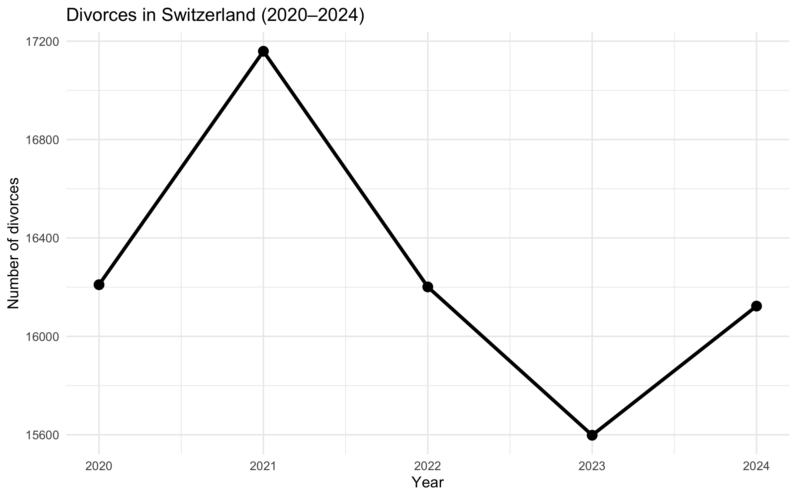
```

**Interpretation:**  
National divorce counts fluctuate over time rather than following a smooth monotonic trend. This suggests that structural or demographic forces influence divorce behavior beyond simple growth patterns.

---

## Highest-divorce cantons (latest year)

```{r v2, fig.width=5, fig.height=3}
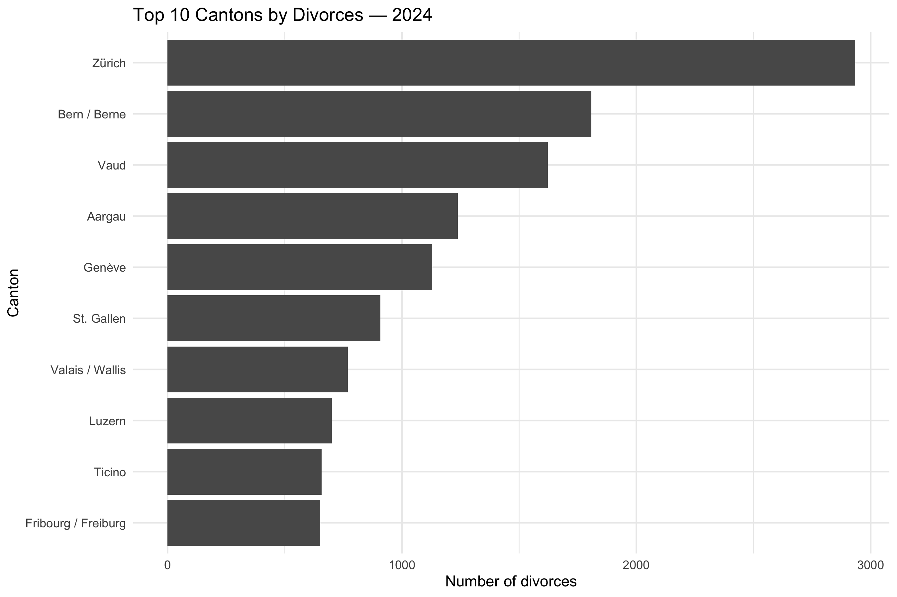
```

**Interpretation:**  
Divorce counts are concentrated in a few cantons, largely reflecting population size differences. Larger cantons naturally produce more divorces in absolute terms.

---

## Ranking changes across time

```{r v3, fig.width=5, fig.height=3}
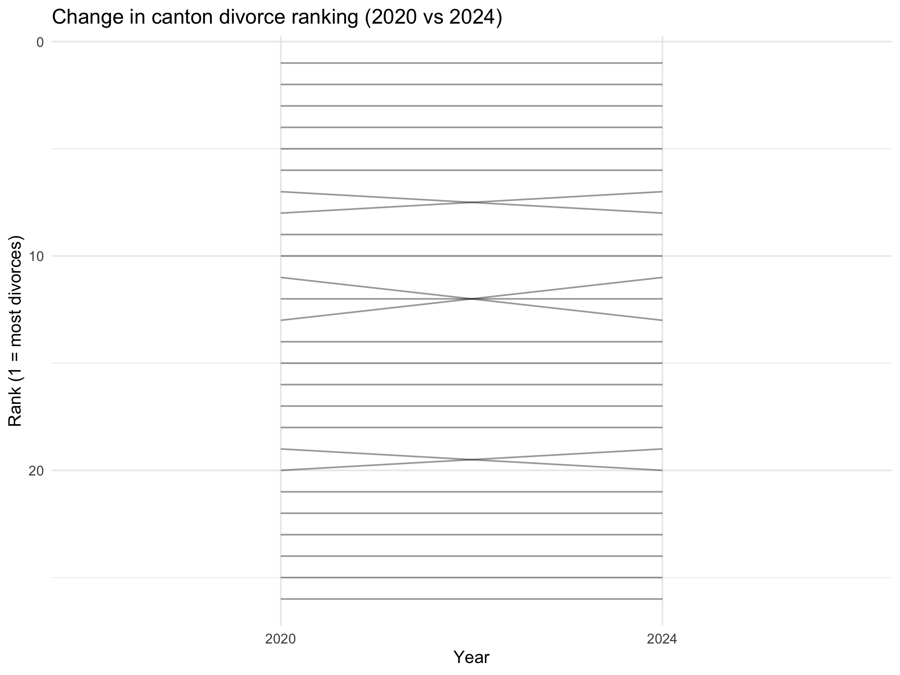
```

**Interpretation:**  
Ranking changes reveal that canton positions are not static. Some regions move up or down over time, suggesting dynamic demographic or social shifts.

---

## Heatmap: canton-by-year pattern

```{r v4, fig.width=6, fig.height=3.6}
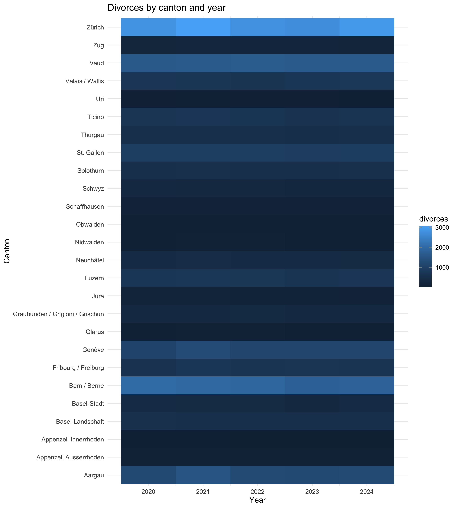
```

**Interpretation:**  
The heatmap provides a compact overview of divorce intensity across cantons and years. Persistent high or low areas indicate stable structural regional differences.

---

## Stability vs volatility

```{r v5, fig.width=5, fig.height=3}
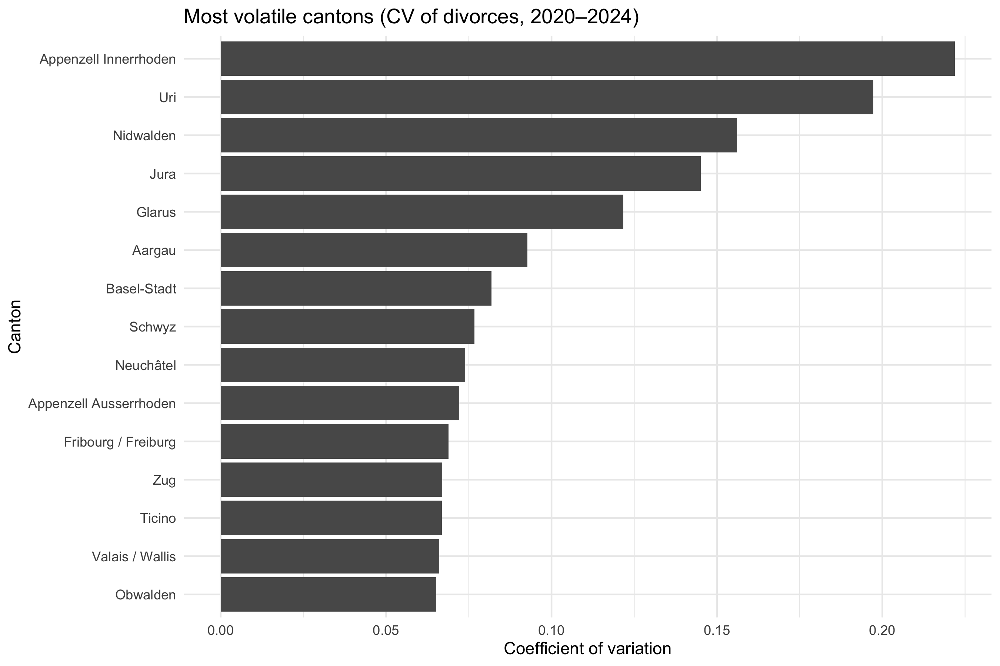
```

**Interpretation:**  
Some cantons show consistent divorce levels, while others fluctuate more strongly. Volatility helps identify regions where divorce patterns are stable versus irregular.

---

## Rate-adjusted comparison

```{r v6, fig.width=5, fig.height=3}
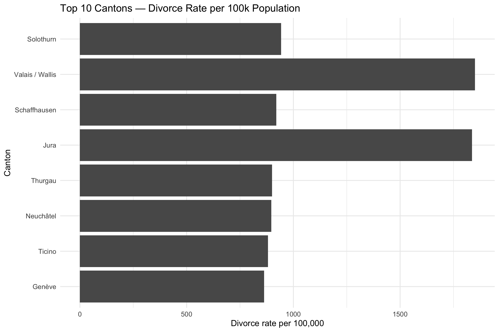
```

**Interpretation:**  
Adjusting for population reveals proportional differences. Cantons with high raw counts may not necessarily exhibit high divorce rates relative to population size.

---

## Population composition by marital status

```{r v7, fig.width=5, fig.height=3}
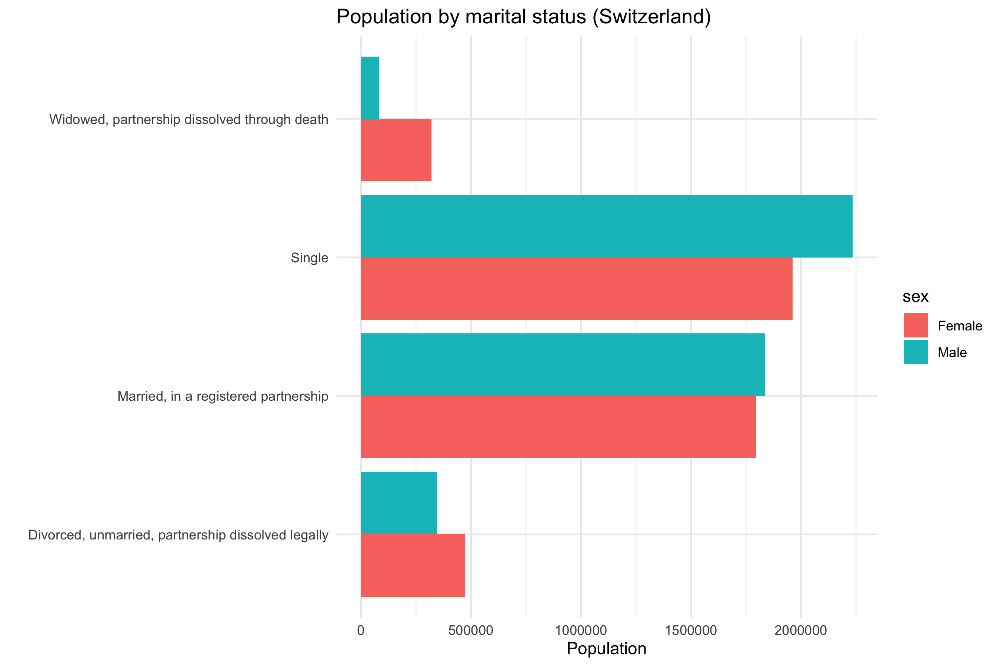
```

**Interpretation:**  
Marital composition differs across regions and years. Divorce counts emerge from populations with varying proportions of married, single, widowed, or divorced individuals.

---

## Married-share ranking

```{r v8, fig.width=5, fig.height=3}
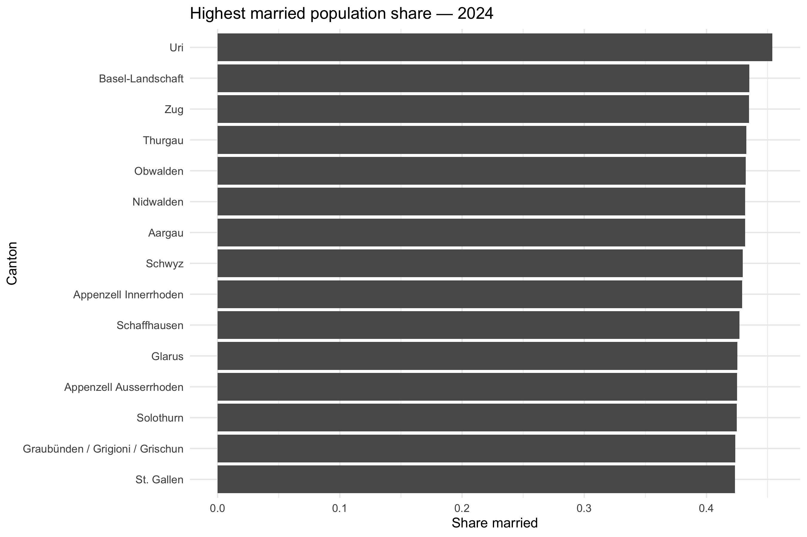
```

**Interpretation:**  
The share of married individuals varies by canton. These demographic differences provide a structural explanation for variation in divorce outcomes.

---

## Sex differences in marital structure

```{r v9, fig.width=5, fig.height=3}
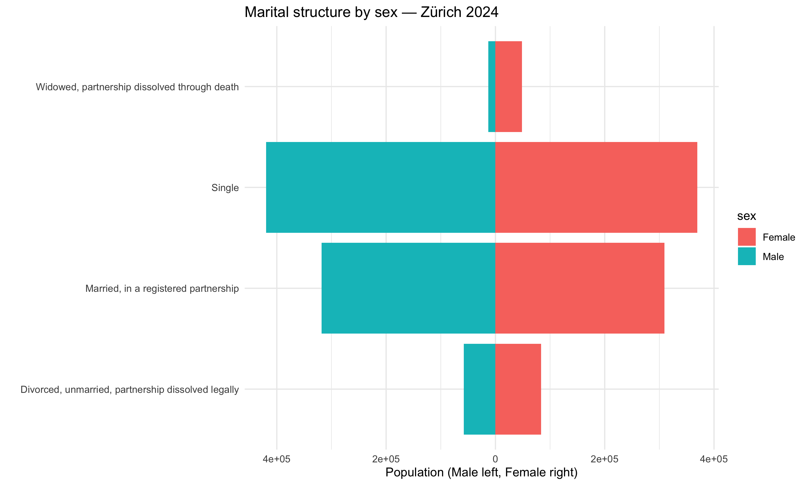
```

**Interpretation:**  
Marital composition differs by sex within cantons. These structural differences influence how divorce counts relate to demographic composition.

---

## Relationship: divorce rate vs married share

```{r v10, fig.width=5, fig.height=3}
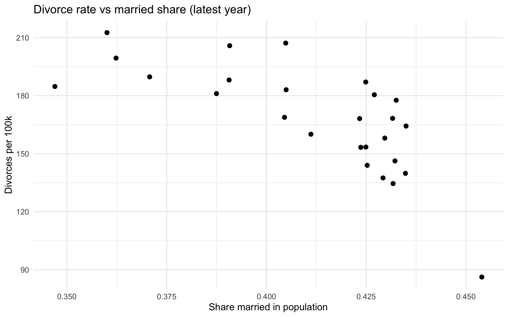
```

**Interpretation:**  
The scatter plot suggests an association between demographic structure and divorce rates, though the relationship is not perfectly linear. This motivates statistical modeling.

---

## Visual summary

Across these visualizations, divorce patterns vary by time, canton, and demographic structure. Population composition and proportional measures provide additional insight beyond absolute counts. These observations motivate the regression modeling approach in the next section.

---

# Statistical Model

To quantify how demographic structure relates to divorce counts, we fit a linear regression model. The goal is not prediction perfection, but to demonstrate how demographic variables help explain variation in divorce outcomes.

We exclude national aggregate rows to focus on canton-level variation.

---

## Model setup

```{r model-load}
joined <- read_csv("data_clean/joined_pop_div.csv")

model_data <- joined %>%
  filter(canton != "Switzerland") %>%
  mutate(
    sex = factor(sex),
    marital_status = factor(marital_status),
    canton = factor(canton)
  )
```

---

## Regression model

We model divorce counts as a function of population size, demographic structure, and time.

```{r model-fit}
model <- lm(
  divorces ~ population + sex + marital_status + year,
  data = model_data
)

summary(model)
```

### Interpretation

The model shows:

- Population size is strongly associated with divorce counts  
- Marital structure significantly explains variation  
- Sex differences are small  
- Time effects are weak relative to demographic structure  

The model explains a substantial share of variation, but not all regional differences.

---

## Model diagnostics

We examine diagnostic plots to assess residual behavior and model assumptions.

```{r model-diagnostics, fig.width=6, fig.height=4}
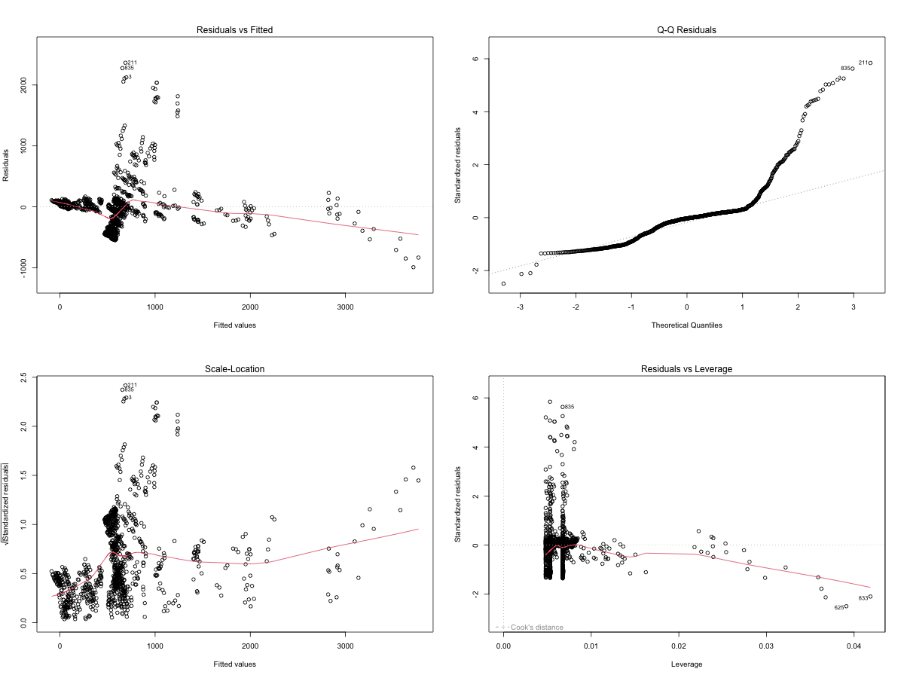
```

### Interpretation

Residual plots indicate:

- No severe structural violations  
- Mild heteroskedasticity typical for count data  
- Reasonable fit given aggregated demographic structure  

---

## Predicted vs actual comparison

```{r model-pred, fig.width=5, fig.height=3}
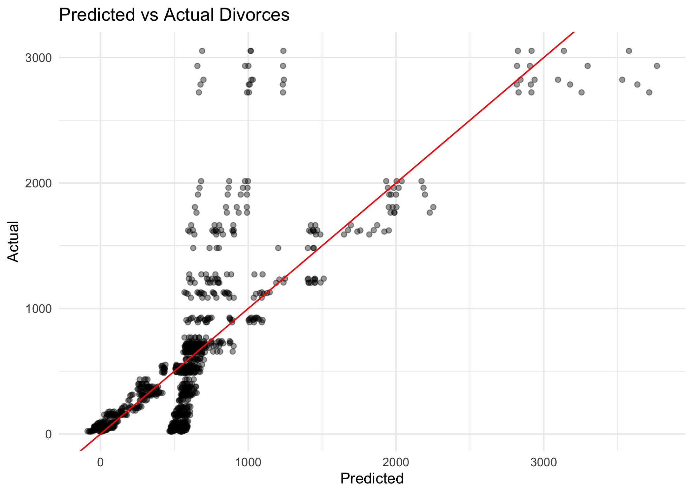
```

### Interpretation

Predicted values align with observed divorce counts, capturing general demographic scaling while leaving room for canton-specific variation.

---

### Model summary

The regression confirms that demographic composition and population scale are dominant drivers of divorce counts. While intentionally simple, the model demonstrates how structured demographic information can be incorporated into statistical analysis.

# Chapter of Choice — Interactive Canton Map (Leaflet)

This chapter provides an interactive geographic view of divorce intensity across Swiss cantons. Unlike static charts, an interactive map allows the reader to explore cantons directly and compare values visually. This goes beyond the standard plotting tools used in the course and highlights regional structure in a more intuitive way.

We create a canton-level divorce rate for a selected year and display it on an interactive map using `leaflet`.

---

## Prepare canton-level divorce rate (selected year)

```{r map-setup}
library(dplyr)
library(readr)
library(sf)
library(leaflet)
library(rnaturalearth)

div_totals <- read_csv("data_clean/div_totals.csv")
pop_clean  <- read_csv("data_clean/pop_clean.csv")

# Choose a year for the map (change if you want)
map_year <- 2024

# Total population per canton-year (sum over sex + marital groups)
pop_totals <- pop_clean %>%
  filter(canton != "Switzerland") %>%
  group_by(year, canton) %>%
  summarise(pop_total = sum(population, na.rm = TRUE), .groups = "drop")

# Divorce rate per 1,000 people
map_df <- div_totals %>%
  filter(canton != "Switzerland", year == map_year) %>%
  left_join(pop_totals %>% filter(year == map_year), by = c("year","canton")) %>%
  mutate(divorce_rate_per_1000 = 1000 * divorces / pop_total)

head(map_df)
```

---

## Load Swiss canton shapes and join data

```{r map-shapes}
# Natural Earth canton shapes for Switzerland (admin-1)
cantons_sf <- rnaturalearth::ne_states(country = "Switzerland", returnclass = "sf")

# Try matching on canton name (Natural Earth uses English names sometimes)
# We'll create a simple name key to improve matching.
cantons_sf <- cantons_sf %>%
  mutate(name_key = tolower(name))

map_df <- map_df %>%
  mutate(name_key = tolower(canton))

# Join rates onto spatial data
cantons_map <- cantons_sf %>%
  left_join(map_df, by = "name_key")

# Quick check for unmatched cantons
sum(is.na(cantons_map$divorce_rate_per_1000))
```

---

## Interactive Leaflet map

```{r leaflet-map, fig.width=8, fig.height=6}
pal <- colorNumeric(palette = "YlOrRd", domain = cantons_map$divorce_rate_per_1000, na.color = "#f0f0f0")

leaflet(cantons_map) %>%
  addProviderTiles(providers$CartoDB.Positron) %>%
  addPolygons(
    fillColor = ~pal(divorce_rate_per_1000),
    weight = 1,
    color = "white",
    fillOpacity = 0.8,
    label = ~paste0(name, ": ", round(divorce_rate_per_1000, 2), " per 1,000"),
    highlightOptions = highlightOptions(weight = 2, color = "#333", bringToFront = TRUE)
  ) %>%
  addLegend(
    pal = pal,
    values = ~divorce_rate_per_1000,
    title = paste0("Divorce rate per 1,000 (", map_year, ")"),
    opacity = 0.8
  )
```

---

## Interpretation

The map shows clear regional differences in divorce rates across cantons. This geographic perspective helps distinguish cantons with high divorce intensity relative to population size, complementing earlier plots that focused on raw counts and rankings.

---
# Conclusions and Limitations

This analysis explored divorce patterns across Swiss cantons by combining demographic population data with canton-level divorce statistics. Through cleaning, merging, visualization, and regression modeling, we examined how structural demographic variables relate to observed divorce counts.

The exploratory visualizations revealed strong geographic variation in divorce counts. Larger cantons naturally exhibit higher absolute divorce totals, but rate-adjusted comparisons showed that proportional differences also exist. Demographic composition — particularly marital structure — appears to play an important role in shaping regional divorce outcomes.

The regression model confirmed that population size is the dominant explanatory factor. Marital-status structure significantly contributes to variation, while time effects are comparatively weak. This suggests divorce counts primarily reflect demographic scale and composition rather than rapid year-to-year social change.

However, several limitations should be acknowledged:

- Divorce counts are aggregated data and do not capture individual-level behavior  
- The model assumes linear relationships that may oversimplify social dynamics  
- Cultural, economic, and policy factors are not explicitly modeled  
- Population structure is treated statically rather than dynamically  

Despite these limitations, the workflow demonstrates how structured demographic data can be used to generate meaningful comparative insight. The project emphasizes reproducible data analysis practices rather than causal claims.

Overall, this study illustrates how demographic structure influences observable social outcomes and provides a foundation for more advanced modeling approaches in future work.

# Reflection on Generative AI Use

Generative AI tools were used throughout this project to support coding, debugging, and workflow structuring. The primary purpose was to assist in translating analytical goals into executable R code while improving efficiency and understanding.

AI support was most helpful in:

- Debugging R syntax and package errors  
- Structuring R Markdown documents  
- Suggesting visualization layouts  
- Explaining model interpretation  
- Organizing analysis workflow  

Importantly, all generated suggestions were manually tested and verified before inclusion. Output was never accepted blindly — code was executed, inspected, and adapted to match the project’s dataset and goals.

AI was less effective when context-specific interpretation was required. Human judgment was necessary to validate whether outputs aligned with demographic reasoning and assignment requirements.

Using generative AI accelerated development while reinforcing the importance of critical evaluation. The experience demonstrated that AI functions best as a collaborative assistant rather than an automated decision-maker.

This reflective process strengthened both technical understanding and analytical thinking, illustrating how AI tools can responsibly augment data analysis workflows.
